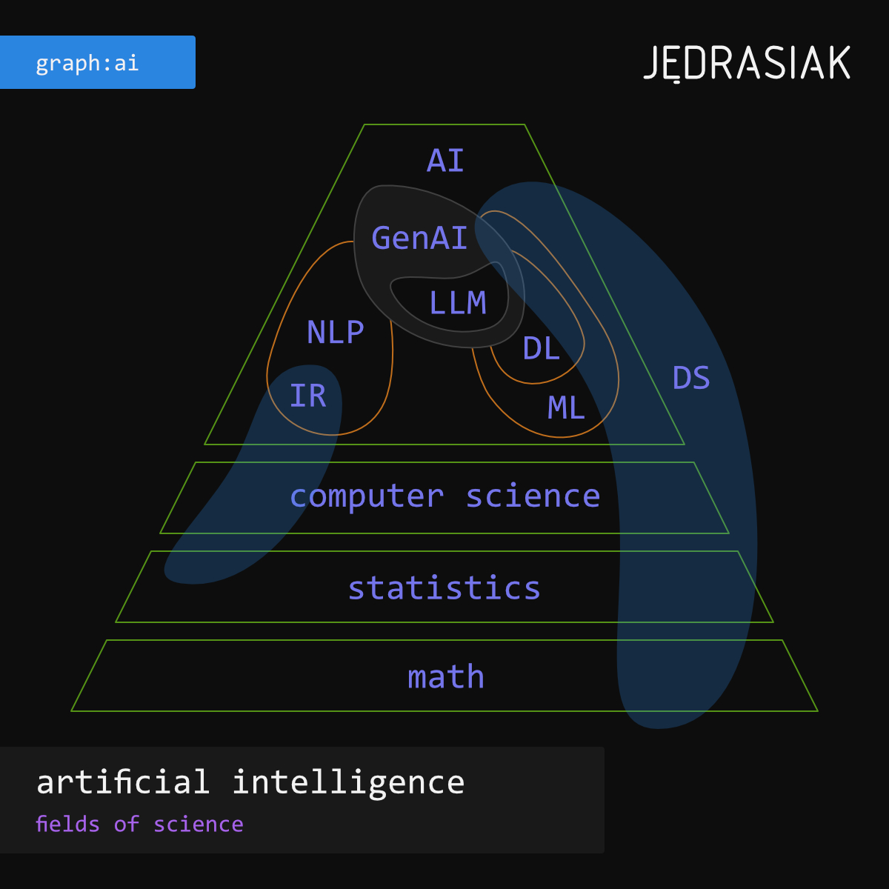

**Artificial intelligence is a field of science that aims to create a computer program capable of mimicking human thought processes (intelligence).**

Selected thought processes that make up human intelligence:
1. understanding incoming messages,
2. processing information,
3. solving problems,
4. making decisions,
5. performing complex tasks.

We are able to effectively mimic all of the above-mentioned processes thanks to Large Language Models (LLM) and the architectures created on their basis: RAG (_Retrieval Augmented Generation_) and Agents.

To take full advantage of the capabilities behind large-scale language models, it is useful to know the technologies that have contributed to their development:
* natural language processing (NLP),
* machine learning (ML),
* deep learning (DL).

Artificial intelligence, so understood, draws on the achievements of the “classical” disciplines:
* mathematics,
* statistics,
* computer science,
* data science (DS).