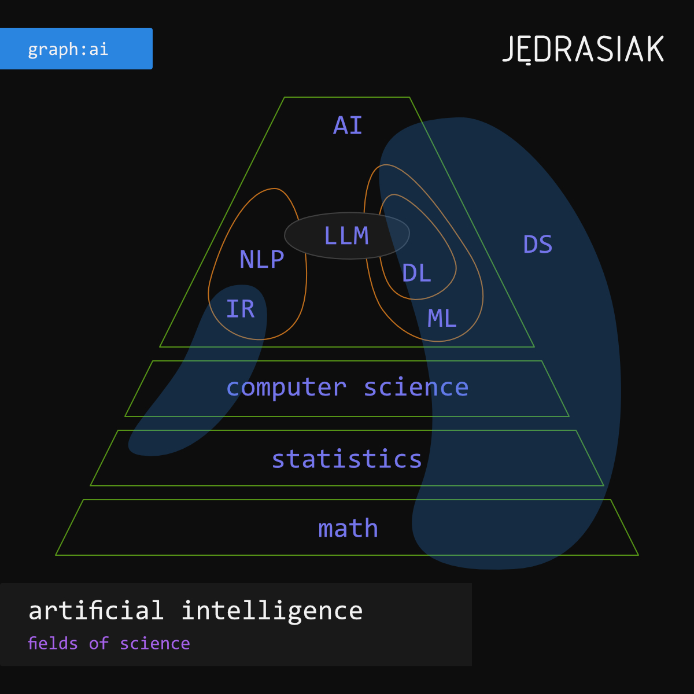

**Sztuczna inteligencja to dziedzina nauki, której celem jest stworzenie programu komputerowego potrafiącego naśladować ludzkie procesy myślowe (inteligencję).**

Wybrane procesy myślowe składające się na ludzką inteligencję:
1. rozumienie napływających komunikatów,
2. przetwarzanie informacji,
3. rozwiązywanie problemów,
4. podejmowanie decyzji,
5. wykonywanie złożonych zadań.

Wszystkie wymienione wyżej procesy jesteśmy w stanie skutecznie naśladować dzięki dużym modelom językowym (LLM – Large Language Models) i stworzonym na ich kanwie architekturom: RAG (_Retrieval Augmented Generation_) oraz Agentom.

Aby w pełni wykorzystać możliwości stojące za dużymi modelami językowymi warto znać technologie, które przyczyniły się do ich powstania:
* przetwarzanie języka naturalnego (NLP – _Natural Language Processing_),
* uczenie maszynowe (ML – _Machine Learning_),
* uczenie głębokie (DL – _Deep Learning_).

Tak rozumiana sztuczna inteligencja czerpie z dorobku "klasycznych" dyscyplin:
* matematyka (_math_),
* statystyka (_statistics_),
* informatyka (_computer science_),
* analiza danych (DS – _data science_).